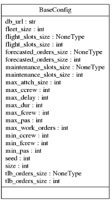
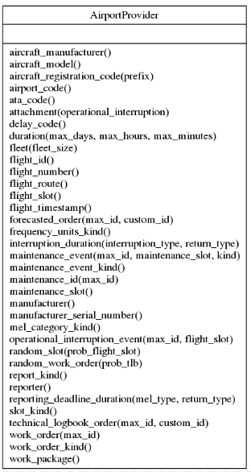
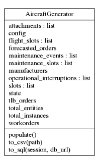

# Rationale

## Poor man's functional architecture

As of commit ffe30eb32b71241f6168b00e4c340818bde0b311, the program structure is as follows:

```plain
project/
├── base
│   ├── config.py
│   ├── __init__.py
│   └── rules.py
├── cli.py
├── __init__.py
├── models
│   ├── classic
│   │   ├── aims.py
│   │   ├── amos.py
│   │   └── __init__.py
│   ├── data
│   │   ├── aims.py
│   │   ├── amos.py
│   │   └── serializable.py
│   ├── declarative
│   │   ├── aims.py
│   │   ├── amos.py
│   │   ├── __init__.py
│   │   └── mixins.py
│   └── __init__.py
├── providers
│   ├── __init__.py
│   └── utils.py
└── scripts
    ├── db_utils.py
    ├── generate.py
    └── __init__.py

```

A full diagram of the classes implemented is available in [a pyreverse autogerenated image.](images/classes.png)

### `project.base`

It contains the module for creating a `Config` object from a `BaseConfig` class. This object is passed to the `AircraftGenerator` to control how data will be generated.



The `project.base.rules` is not being used at the moment.

### `project.models`

It contains the models used by SQLAlchemy, a python ORM (Object Relational mapper) that translates SQL to python objects, handles transactions and everything that an ORM does.

These models are separated by schema, e.g. _AMOS_ and _AIMS_ and also by the type of mapping used _declarative_ (more abstract) and _classical_ (more explicit). Only the declarative models are being used, the classical were the first iteration.

There are also the models from `project.models.data.serializable` that describe the data that is stored as CSV files, e.g. `Manufacturer` and `Reporter`

### `project.cli`

Controls the CLI (command line interface) implemented in the program.

### `project.providers`

Implements an `AirportProvider`, an extension of the `Faker.BaseProvider` class. Basically, an instance of `AirportProvider` exposes several methods used to produce contextually valid random data, like



An instance of this provider can be imported from `project.providers.fake`.
Most of these methods implement a `quality` attribute, which can one from the set `("good","noisy","bad")`

```python
from project.providers import fake
>>> fake.airport_code(quality="good") # valid random value
'TIV'
>>> fake.airport_code(quality="noisy") # introduces noise
'     tiV  '
>>> fake.airport_code(quality="bad") # non valid random value: airport code can't have numbers
'4ys'
```

By default, if not implemented, all _bad_ values are strings of length 5 containing a combination of letters, numbers, and non-alphanumeric characters.

```python
from project.providers import fake
>>> fake.random_string()
'H\\<O}'>>>
>>> fake.random_string(10)
'SC^JrjjyY='
```

### `project.scripts.generate`

Implements the `AircraftGenerator` class, which consumes both a `Config` and the `AirportProvider` objects, and assists in the generation and insertion of a collection of datasets.



Through the `project.config.BaseConfig` object, data is sampled from different qualities, with some probabilities. By default they are 70% probability of getting a good quality, 20% of getting noisy quality, and 10% of getting broken data.

Also, `BaseConfig.size` controls how many rows are produced, as well as the database credentials that will be used by SQLAlchemy. Check the code for more info.

the generator implements three important methods,

- `populate` reads the configuration object and produces lists of random objects accordingly. They are stored as properties of the generator, e.g. `generator.flight_slots`.
- `to_csv` takes these generated elements from `populate` in the `generator` and saves them to CSV files.
- `to_sql` (should be called `to_db`, I know) dumps the random data into a database defined in the config.

## Generating good, noisy and bad data

Most method in `AirportProvider` that produce random data expose a `quality` parameter. The method outputs a random number accordingly, using a thin dispatcher, like

```python
def _quality_dispatcher(self, mapping, quality):
    mapping["noisy"] = self._make_noisy(mapping["good"])
    return mapping[quality]

def frequency_units_kind(self, quality: str = "good") -> str:
        mapping = {
            "good": self.random_element(self._frequency_units_kinds),
            "bad": self.random_string(random.randint(2, 5)),
        }
        return self._quality_dispatcher(mapping, quality)
```

This is the part where what a _good_ and a _bad_ value is defined in relation to each specific field. In this case, we say that a _good_ value is sampled from the collection of _frequency unit kinds_, and a _bad_ value is a string of random characters and random length between 2 and 5.

```python
>>> fake.frequency_units_kind()
'Miles'
>>> fake.frequency_units_kind(quality = "noisy")
'     mIles  '
>>> fake.frequency_units_kind(quality = "bad")
'hWsz'
```

A _noisy_ value is a modified version of a _good_ value, that is meant to be fixed by trimming whitespace and updating to some conformed standard. For the case of _frequency units_, this is

1. trim whitespace
2. convert to lowercase
3. convert first char to uppercase

In python, something like this

```python
>>> noisy_str
'     mIles  '
>>> noisy_str = noisy_str.strip()
>>> noisy_str
'mIles'
>>> noisy_str =  noisy_str[0].upper() +  noisy_str[1:].lower()
>>> noisy_str
'Miles'
```

Some important considerations regarding implementation

- A _bad_ value should be impossible to reconstruct (or very hard) and should not conform to the rules. 
- In general, the *bad* version implemented is arbitrary.
- There should be only one way to add noise to objects depending on their type